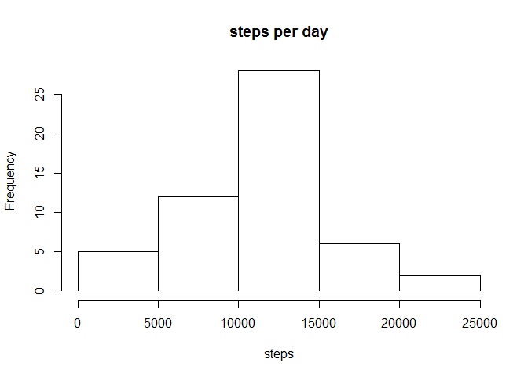
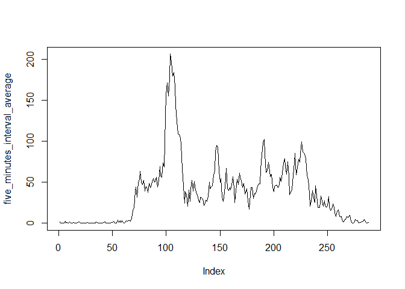
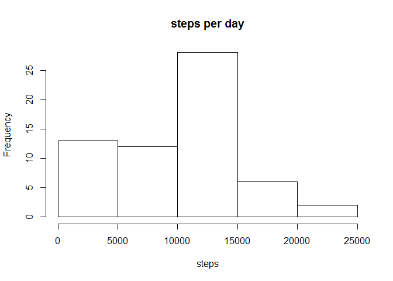
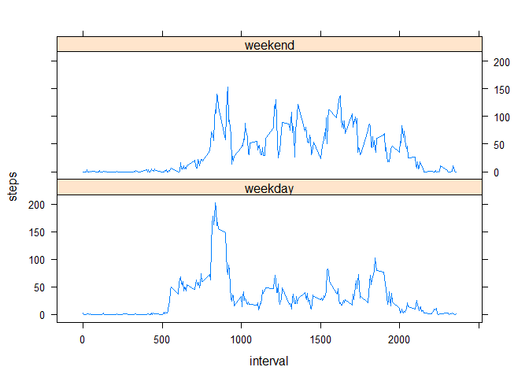

# Reproducible Research: Peer Assessment 1


## Loading and preprocessing the data
* Load the data

```r
activity_data <- read.csv("activity/activity.csv")
```

## What is mean total number of steps taken per day?
* Calculate the total number of steps taken per day

```r
step_sum_by_date <- aggregate(activity_data$steps, list(activity_data$date), sum, na.rm = TRUE)
names(step_sum_by_date) <- c("date", "steps")
step_sum_by_date_ignore_zero <- step_sum_by_date[which(step_sum_by_date$steps != 0), ]
print(step_sum_by_date_ignore_zero)
```

```
##          date steps
## 2  2012-10-02   126
## 3  2012-10-03 11352
## 4  2012-10-04 12116
## 5  2012-10-05 13294
## 6  2012-10-06 15420
## 7  2012-10-07 11015
## 9  2012-10-09 12811
## 10 2012-10-10  9900
## 11 2012-10-11 10304
## 12 2012-10-12 17382
## 13 2012-10-13 12426
## 14 2012-10-14 15098
## 15 2012-10-15 10139
## 16 2012-10-16 15084
## 17 2012-10-17 13452
## 18 2012-10-18 10056
## 19 2012-10-19 11829
## 20 2012-10-20 10395
## 21 2012-10-21  8821
## 22 2012-10-22 13460
## 23 2012-10-23  8918
## 24 2012-10-24  8355
## 25 2012-10-25  2492
## 26 2012-10-26  6778
## 27 2012-10-27 10119
## 28 2012-10-28 11458
## 29 2012-10-29  5018
## 30 2012-10-30  9819
## 31 2012-10-31 15414
## 33 2012-11-02 10600
## 34 2012-11-03 10571
## 36 2012-11-05 10439
## 37 2012-11-06  8334
## 38 2012-11-07 12883
## 39 2012-11-08  3219
## 42 2012-11-11 12608
## 43 2012-11-12 10765
## 44 2012-11-13  7336
## 46 2012-11-15    41
## 47 2012-11-16  5441
## 48 2012-11-17 14339
## 49 2012-11-18 15110
## 50 2012-11-19  8841
## 51 2012-11-20  4472
## 52 2012-11-21 12787
## 53 2012-11-22 20427
## 54 2012-11-23 21194
## 55 2012-11-24 14478
## 56 2012-11-25 11834
## 57 2012-11-26 11162
## 58 2012-11-27 13646
## 59 2012-11-28 10183
## 60 2012-11-29  7047
```

* Make a histogram of the total number of steps taken each day

```r
hist(step_sum_by_date_ignore_zero$steps, main = "steps per day", xlab = "steps")
```

 

* Calculate and report the mean and median of the total number of steps taken per day

```r
mean(step_sum_by_date_ignore_zero$steps)
```

```
## [1] 10766.19
```

```r
median(step_sum_by_date_ignore_zero$steps)
```

```
## [1] 10765
```

## What is the average daily activity pattern?
* Make a time series plot (i.e. type = "l") of the 5-minute interval (x-axis) and the average number of steps taken, averaged across all days (y-axis)

```r
five_minutes_interval_average <- tapply(activity_data$steps, activity_data$interval, mean, na.rm = TRUE)
plot(five_minutes_interval_average, type = "l")
```

 

* Which 5-minute interval, on average across all the days in the dataset, contains the maximum number of steps?

```r
names(which.max(five_minutes_interval_average))
```

```
## [1] "835"
```

## Imputing missing values
* Calculate and report the total number of missing values in the dataset (i.e. the total number of rows with NAs)

```r
sum(is.na(activity_data))
```

```
## [1] 2304
```

* Create a new dataset that is equal to the original dataset but with the missing data filled in with the mean for that day.

```r
mean <- aggregate(activity_data$steps, list(activity_data$date), mean)
mean[which(is.na(mean[, 2])), 2] <- 0
for (row in which(is.na(activity_data$steps))) {
        activity_data[row, 1] <- mean[activity_data[row, 2], 2]
}
```

* Make a histogram of the total number of steps taken each day and calculate and report the mean and median total number of steps taken per day.

```r
step_sum_by_date_fill_na <- aggregate(activity_data$steps, list(activity_data$date), sum)
names(step_sum_by_date_fill_na) <- c("date", "steps")
hist(step_sum_by_date_fill_na$steps, main = "steps per day", xlab = "steps")
```

 

```r
mean(step_sum_by_date_fill_na$steps)
```

```
## [1] 9354.23
```

```r
median(step_sum_by_date_fill_na$steps)
```

```
## [1] 10395
```

## Are there differences in activity patterns between weekdays and weekends?
* Create a new factor variable in the dataset with two levels – “weekday” and “weekend” indicating whether a given date is a weekday or weekend day.

```r
mean <- aggregate(activity_data$steps, list(activity_data$date), mean)
mean[which(is.na(mean[, 2])), 2] <- 0
for (row in which(is.na(activity_data$steps))) {
        activity_data[row, 1] <- mean[activity_data[row, 2], 2]
}
activity_data <- cbind(activity_data, weekdays(as.Date(activity_data$date)))
names(activity_data) <- c("steps", "date", "interval", "weekday")
wday <- vector()
for (row in 1 : nrow(activity_data)) {
	if (activity_data[row, 4] == levels(activity_data$weekday)[5] ||
		activity_data[row, 4] == levels(activity_data$weekday)[6]) {
		wday <- c(wday, "weekend")
	} else {
		wday <- c(wday, "weekday")
	}
}
activity_data$wday <- wday
```

* Make a panel plot containing a time series plot (i.e. type = "l") of the 5-minute interval (x-axis) and the average number of steps taken, averaged across all weekday days or weekend days (y-axis).

```r
options( warn = -1 )
activity_weekday <- data.frame()
activity_weekend <- data.frame()
for (row in 1: nrow(activity_data)) {
	if (activity_data[row, 5] == "weekday") {
		activity_weekday <- rbind(activity_weekday, activity_data[row, ])
	} else {
		activity_weekend <- rbind(activity_weekend, activity_data[row, ])
	}
}

agg_weekday <- aggregate(activity_weekday, list(activity_weekday$interval), mean, na.rm = TRUE)
agg_weekday$wday <- "weekday"
agg_weekend <- aggregate(activity_weekend, list(activity_weekend$interval), mean, na.rm = TRUE)
agg_weekend$wday <- "weekend"

library(lattice)
xyplot(steps ~ interval | wday, rbind(agg_weekday, agg_weekend), type = "l", layout = c(1, 2))
```

 
